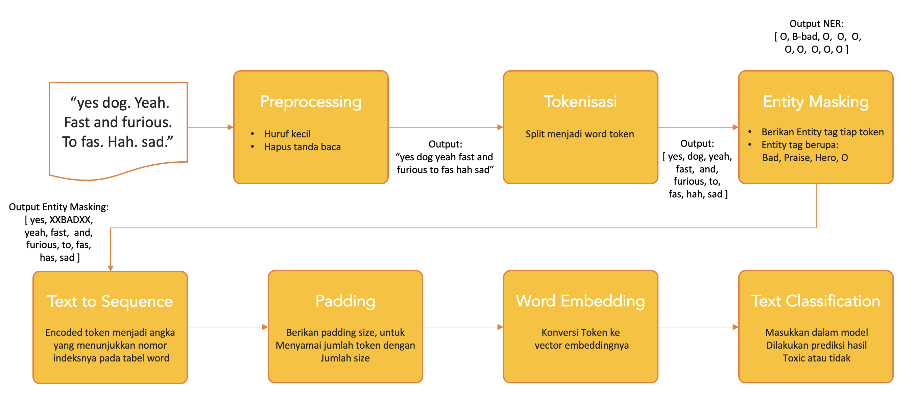

# Dota 2 Toxic Player Detection
IF6082 Pemrosesan Bahasa Alami
Institut Teknologi Bandung

Arrival Dwi Sentosa (23519035)

## 1. Deskripsi

Aplikasi yang bertujuan untuk mendeteksi apakah seorang pemain Dota 2 bersifat toxic atau tidak, berdasarkan rekaman percakapan dalam satu pertandingan.

### a. Dataset
Dataset yang digunakan adalah dataset percakapan pemain dalam game Dota 2. Dataset yang digunakan memiliki karakteristik sebagai berikut: 
- Mengandung spelling-error,
- Kebanyakan tidak mengikuti grammatical structure,
- Mengandung pidgin language, bahasa tidak baku, banyak bahasa bercampur dalam satu kalimat, contoh: 
- Banyaknya istilah atau jargon yang hanya dikenal dalam dunia Dota 2 seperti, am (Anti Mage), bb (Buy Back atau Bristleback), noob, dll,
- Pemain saling menyapa menggunakan nama hero yang digunakan, contoh: hey cm, back i have no mana.

Dataset mengandung banyak bahasa, dan yang menjadi fokus pada penelitian ini adalah *bahasa inggris*.

### b. Modul
Aplikasi ini dibangun dengan pendekatan machine learning dengan menggunakan tiga modul utama, yaitu Name Entity Recognizer, Word Embedding,  dan Text Classification.

#### i. Name Entity Recognizer
Modul ini mencoba menyelesaikan masalah pada dataset yang mengandung jargon dengan cara mengategorikan nama hero, nama item, kata kasar, dll, yang akan digunakan pada salah satu preprocessing agar hasil yang diperoleh pada saat deteksi lebih bagus.

#### ii. Word Embedding
Modul ini mencoba menyelesaikan masalah dataset yang mengandung banyak kalimat yang tidak mengikut struktur grammar, pidgin language, dan spellling error dengan cara mengubah kata menjadi vektor angka yang merepresentasikan kata dalam suatu context (similar word has similar context). Karena karakteristik dataset tersebut juga membuat word embedding yang sudah ada tidak dapat digunakan, sehingga word embedding yang dibangun dilatih dengan dataset yang digunakan.

#### iii.	Text Classification
Text Classification yang bertujuan untuk melakukan deteksi kalimat yang dikeluarkan oleh pemain dalam satu pertandingan mengandung unsur toxic atau tidak.

## 2. Latar Belakang
Toxic dalam permain Dota 2 bermakna bahwa pemain tersebut memiliki sikap yang tidak baik terhadap pemain lain atau terhadap jalannya permainan, sehingga merugikan pemain lain. Perilaku toxic bisa berupa action seperti sengaja bermain jelek atau bisa dalam bentuk ujaran tulisan melalui fitur percakapan. Eksperimen ini berfokus pada deteksi perilaku toxic melalui ujuaran tulisan. Bentuk perilaku toxic melalui ujaran tulisan seperti, menyalahkan pemain lain, menghina pemain lain dengan perkataan kasar, bahkan berbau SARA.

Kehadiran pemain toxic membuat pengalaman bermain menjadi buruk. Tujuan pemain yang berniat untuk melepas kepenatan dengan bermain game tidak tercapai karena kehadirannya dan pemain yang mengalami pengalaman buruk ini beberapa memutuskan untuk berhenti bermain lagi. Selain itu, perilaku toxic juga menghambat pertumbuhan pemain baru karena perilaku toxic sangat menekan pemain baru untuk melakukan kesalahan, padahal pemain baru pasti  melakukan hal tersebut.  Beberapa website, baik berupa forum diskusi atau artikel menganalisis bahwa salah satu penyebab Dota 2 mengalami penurunan jumlah pemain karena kehadiran pemain toxic [1]–[3]. 

Valve sebagai pengembang game ini telah melakukan beberapa hal untuk menekan perilaku ini, yaitu dengan menyertakan kolom laporan bagi para pemain untuk melaporkan pemain lain yang dianggap berperilaku toxic dan memberi hukuman berupa menutup akses bermain untuk pemain tersebut dalam waktu beberapa hari jika pemain tersebut terbukti berperilaku toxic. Setelah laporan diterima, pemain yang dilaporkan tidak otomatis diberikan hukuman, tetapi laporan tersebut direview terlebih dahulu. Proses review sangat tidak mungkin dilakukan dengan cara manual karena jumlah pertandingan harian Dota 2 ada sebanyak xxx game. Oleh karena itu, kehadiran aplikasi ini diharapkan dapat membantu pengembang Dota 2 untuk mendeteksi pemain toxic, sehingga pengalaman bermain dapat menjadi lebih baik lagi.

## 3.	Aplikasi Sejenis
Penelitian tentang memprediksi hasil pertandingan menggunakan riwayat percakapan pada game Dota [4]. Penelitian tersebut menggunakan dataset Dota. Dota adalah versi lama dari Dota 2 yang merupakan game custom map pada game Warcraft III. Model prediksi dibangun menggunakan Support Vector Machine (SVM) dan feature menggunakan TF-IDF dengan N-gram. Penelitian tersebut bertujuan untuk menunjukkan bahwa perilaku toxic memiliki dampak, sehingga riwayat percakapan dapat dijadikan fitur untuk memprediksi hasil dari pertandingan dalam game tersebut. Penelitian tersebut menemukan bahwa tim yang kalah lebih cenderung perilaku toxic. Tetapi perilaku chat melalu percakapan tidak dapat digunakan untuk menentukan hasil dari sebuah pertandingan, karena akurasinya rendah yaitu sekitar 65%.

Model untuk identifikasi percakapan mengandung toxic atau tidak pada penelitian tersebut digunakan untuk kebutuhan analisis saja, bukan bagian dari salah satu modul dalam pembuatan model prediksi. Model tersebut nantinya dipakai untuk mendukung hipotesisnya bahwa perilaku toxic itu berdampak pada jalannya permainan. 

Proses pembuatan Model identifikasi toxic menggunakan rule based dan data dari N-gram token yang telah dibuat dalam membuat model prediksi pertandingan. Data n-gram yang sudah dibangun kemudian dipilih sebanyak 100 n-gram token yang kemunculannya terbanyak dan secara manual diidentifikasi mana yang mengandung makna toxic. Untuk 1-gram proses penentuan berdasarkan token tersebut memiliki makna menghina atau tidak dan untuk 2-gram, 3-gram, dan 4-gram proses penentuan berdasarkan token tersebut memiliki makna menghina ke seseorang atau tidak.  N-gram token yang telah dipilih sebagai toxic tersebut nantinya digunakan untuk dibandingkan dengan kalimat yang ingin diidentifikasi. Jika kalimat tersebut mengandung n-gram token yang sudah diidentifikasi sebagai toxic, maka kalimat tersebut tergolong sebagai kalimat toxic.

## 4. Alur Aplikasi
Aplikasi terdiri dari 3 modul utama, yaitu modul Name Entity Recognition, Word Embedding, dan Text Classification. Dengan alur sebagai berikut:

1. **Preprocessing**: Pada tahap ini dokumen dijadikan huruf kecil dan dibuang tanda bacanya.  Contoh:  Input: [ “yes dog. Yeah. Fast and furious. To fas. Hah. sad.”, “no idiot. We too pro. Lol” , ... ] Output: [ “yes dog yeah fast and furious to fas hah. sad”, “no idiot we too pro lol”, ... ]
2. **Tokenisasi**: Setiap dokumen dipecah menjadi word token. Contoh: Input: [ “yes dog yeah fast and furious to fas hah. sad”, “no idiot we too pro lol”, ... ] Output: [ [ yes, dog, yeah, fast, and, furious, to, fas, hah, sad ], [no, idiot, we, too, pro, lol ] , ... ]
3. **Entity Masking**: pada tahap ini, modul Name Entity Recognition digunakan, untuk entity yang ditemukan, token tersebut akan diganti dengan nama entitynya. Contoh: Input: [ [ yes, dog, yeah, fast, and, furious, to, fas, hah, sad ], [no, idiot, we, too, pro, lol ] , ... ] Output: [ [ yes, XXBADXX, yeah, fast, and, furious, to, fas, hah, sad ], [no, XXBADXX, we, too, pro, lol ] ...] 
4. **Text To Sequence**: setiap token di encoded menjadi angka yang menunjukkan nomor indeksnya pada tabel word. Contoh: Input: [ [ yes, XXBADXX, yeah, fast, and, furious, to, fas, hah, sad ], [no, XXBADXX, we, too, pro, lol ] ...]  Output: [ [159, 10, 173, 118, 14, 1045, 135, 1046, 29, 66], [21, 10, 33, 135, 90, 7], ...] 
5. **Padding**: karena panjang dokumen berbeda-beda, maka setiap dokumen yang jumlah tokennya kurang dari SIZE, maka ukuran arraynya dijadikan SIZE dengan menambahkan item yang bernilai 0. Contoh: Input: [ [159, 10, 173, 118, 14, 1045, 135, 1046, 29, 66], [21, 10, 33, 135, 90, 7], ...]   Output: [ [159, 10, 173, 118, 14, 1045, 135, 1046, 29, 66, 0, 0, ..., 0], [21, 10, 33, 135, 90, 7, 0, 0, ... 0], ...] 
6. **Word Embedding**: setiap token akan dikonversi ke vector embeddingnya menggunakan modul Word Embedding. Contoh: Input: [ [159, 10, 173, 118, 14, 1045, 135, 1046, 29, 66, 0, 0, ..., 0], [21, 10, 33, 135, 90, 7, 0, 0, ... 0], ...] Output: [ [ [ 0.01241145, ..., -0.00270127], [ 0.07907426, ..., -0.05612363], ... ], [ [0.04298469, ..., -0.01875727], [ 0.07907426, ..., -0.05612363], ...], ... ]
7. **Text Classification**: hasil konversi dari word embedding, kemudian dimasukkan ke dalam model yang dibuat pada modul Text Classification, untuk diprediksi hasilnya. Contoh: Input: [ [ [ 0.01241145, ..., -0.00270127], [ 0.07907426, ..., -0.05612363], ... ], [ [0.04298469, ..., -0.01875727], [ 0.07907426, ..., -0.05612363], ...], ... ] Output: [ [0.77449614, 0.22550388], [0.80891067, 0.19108935], ...] 

## 5. Modul NLP
### a. Name Entity Recognizer
#### i. Teknik
Pembangunan NER dengan Conditional Random Fields (CRFs) yang umum digunakan untuk labeling dan parsing sequential data.

Feature Extraction
Fitur didapatkan dengan (word parts, tag POS yang disederhanakan, lower/title/upper flags, features of nearby words) dan ubah menjadi format sklearn-crfsuite, setiap kalimat dikonversi ke daftar kamus.
Lalu dilakukan split data untuk train (80%) dan test data (20%)

#### ii. Data
Model dilatih menggunakan dataset dota 2 chat sebanyak 100 kalimat yang sudah dilakukan manual labeling untuk POS Tag dan Entity Tags (O, hero, praise, bad). Dengan format tagging IOB, Bentuk datasetnya sebagai berikut:

| Kalimat | Kata | Tag
|------|------|------|
| Sentence: 1 |yes | O
|	| dog |	B-bad
| Sentence: 2 | yeah | O
| Sentence: 3 | fast | O
|	| and | O
|	| furious | O
| Sentence: 4 | too | O
|	| fas | O
| Sentence: 5 | haha | O
| Sentence: 6 | sad | O
|   ...  | ... | ... |

#### iii. Eksperimen (Hasil dan Analisis)

| Precision | Recall | F1-Score | Support
|------|------|------|------|
| B-bad | 1.00 | 0.25 | 0.40 | 4
| B-her | 0.00 | 0.00 | 0.00 | 5
| B-pra | 0.67 | 0.33 | 0.44 | 12
| I-her | 0.00 | 0.00 | 0.00 | 1
| I-bad | 1.00 | 0.50 | 0.67 | 2
| I-pra | 0.75 | 0.38 | 0.50 | 8
| O | 0.86 | 0.98 | 0.92 | 128
| accuracy | | | 0.85 | 158
| macro avg | 0.55 | 0.32 | 0.38 | 158
| weighted avg | 0.81 | 0.85 | 0.81 | 158

### b. Word Embedding
#### i. Teknik
Pembangunan model Word Embedding menggunakan teknik Skip-Gram.

Source : https://miro.medium.com/max/1700/0*yxs3JKs5bKc4c_i8.png

Pada tahap ini juga dibangun, tabel word index yang berisi pemetaan token dan indeks. Tabel word index ini digunakan nantinya untuk membuat tabel word embedding, dan untuk encoding pada modul text classification. Tabel word index bentuknya seperti berikut ini:

| Indeks | Token   |
|------|------|
|   1  | OOV |
|   2  | i |
|   3  | gg |
|   ...  | ... |

Setelah proses pelatihan dan model word embedding telah jadi, model tersebut kemudian digunakan untuk membuat tabel word embedding. tabel word embedding memetakan indeks setiap token dengan value word embeddingnya. Tabel word embedding bentuknya sebagai berikut:

| Indeks | Vector Word Embedding   |
|------|------|
|   1  | [0.00000000e+00,  0.00000000e+00, ..., 0.00000000e+00] |
|   2  | [-0.25935695, -0.24364145, ..., 0.35460544] |
|   3  | [-2.42174849e-01, -2.28570521e-01, ..., 3.44555348e-01] |
|   ...  | ... |

Tabel word index dan word embedding akan digunakan pada tahap text classification.

#### ii. Data
Model dilatih menggunakan dataset dota 2 chat. Bentuk datasetnya sebagai berikut:

| Dokumen | Kalimat Ke | Text |
|------|------|------|
|   1  | 1 | yes dog |
|   1  | 2 | yeah |
|   1  | 3 | fast and furious |
|   1  | 4 | too fas |
|   1  | 5 | haha |
|   1  | 6 | sad |
|   2  | 1 | no idiot |
|   2  | 2 | we too pro |
|   2  | 3 | lol |
|   ...  | ... | ... |

### c. Text Classification
#### i. Teknik
Pada modul ini, ada 2 teknik yang digunakan dalam membangun model classifier. Beberapa teknik ini digunakan pada skenario yang berbeda pada saat eksperimen.
1. LSTM
Arsitektur LSTM yang digunakan sebagai berikut:

2. Bidirectional LSTM
Arsitektur Bidirectional LSTM yang digunakan sebagai berikut:

Input untuk semua teknik berupa daftar token dari sebuah dokumen yang telah di encoding menggunakan tabel word index yang dibangun pada saat membuat modul Word Embedding. Output dari  hasil classification berupa nilai peluang dokumen tersebut terhadap suatu kelas.

#### ii. Data
Model dilatih menggunakan dataset dota 2 chat. Bentuk datasetnya sebagai berikut:

| Category | Match | Slot | Text |
|------|------|------|------|
|   0  | 2 | 0 | yes dog. yeah . fast and furious. too fas. haha. sad. |
|   0  | 2 | 2 | no idiot. we too pro. lol. |
|   ...  | ... | ... |

Penjelasan Kolom:
- **Category**:  menunjukkan kelas setiap dokumen yang valuenya terdiri atas 2, yaitu 0 berarti tidak toxic dan 1 berarti toxic.
- **Match**: Id pertandingan
- **Slot**:  slot pemain pada pertandingan tersebut
- **Text**: Kumpulan percakapan yang dilakukan pemain pada pertandingan tersebut.

Jumlah Category dalam dataset sebagi berikut:

#### iii. Eksperimen (Hasil dan Analisis)
Eksperimen akan dilakukan dalam beberapa skenario untuk mencari model terbaik dengan menggunakan validation test dan dengan menggunakan beberapa parameter yaitu:
1. Teknik: LSTM dan Bidirectional LSTM
2. Entity Masking: Memakai Entity Masking dan tanda Entity Masking
3. Panjang Vector Embedding: 50 dan 100
4. Dropout Layer: Memakai Dropout Layer dan tanpa Dropout Layer

Skenario eksperimen untuk pencarian model terbaik sebagai berikut:

| Skenario | Teknik | Entity Masking | Panjang Vector Embedding | Dropout Layer |
|------|------|------|------|------|
|   A  | LSTM | Tidak | 50 | Tidak |
|   B  | LSTM | Tidak | 50 | Ya |
|   C  | LSTM | Tidak | 100 | Tidak |
|   D  | LSTM | Tidak | 100 | Ya |
|   E  | LSTM | Ya | 50 | Tidak |
|   F  | LSTM | Ya | 50 | Ya |
|   G  | LSTM | Ya | 100 | Tidak |
|   H  | LSTM | Ya | 100 | Ya |
|   I  | Bidirectional LSTM | Tidak | 50 | Tidak |
|   J  | Bidirectional LSTM | Tidak | 50 | Ya |
|   K  | Bidirectional LSTM | Tidak | 100 | Tidak |
|   L  | Bidirectional LSTM | Tidak | 100 | Ya |
|   M  | Bidirectional LSTM | Ya | 50 | Tidak |
|   N  | Bidirectional LSTM | Ya | 50 | Ya |
|   O  | Bidirectional LSTM | Ya | 100 | Tidak |
|   P  | Bidirectional LSTM | Ya | 100 | Ya |

Data train dan data test akan dibagi menjadi **70 : 30**. Ratio ini dipilih karena orde datasetnya hanya ratusan. Menggunakan **5-Fold Validation** dan Metric yang digunakan sebagai alat ukur performa model menggunakan **F1 Score**, karena jumlah category 0 dan 1 tidak seimbang.

##### a) Hasil Eksperimen

**Validation**
Berikut hasil validation test:

| Skenario | F1 Score (%) |
|------|------|
|   A  | 74.21 |
|   B  | 66.29 |
|   C  | 74.83 |
|   D  | 68.69 |
|   E  | 63.24 |
|   F  | 69.11 |
|   G  | 73.44 |
|   H  | 66.01 |
|   I  | 75.81 |
|   J  | 80.57 |
|   K  | 81.19 |
|   L  | 80.91 |
|   M  | 79.30 |
|   N  | 78.87 |
|   O  | 78.76 |
|   P  | 77.72 |

Sehingga Model Terbaik yang dipilih pada Skenario K

**Testing** 
Model terbaik digunakan untuk diuji dengan data test dan hasil 71.42%

##### b) Analisis

1. Model terbaik, cenderung menanggap dokumen tersebut bersifat toxic jika dokumen mengandung kata yang banyak. 2 Contoh pertama adalah dokumen yang mengandung kata kurang lebih 80 kata dalam dokumennya, dimana yang pertama berlabel toxic dan kedua berlabel tidak toxic. Model menganggap dua dokumen tersebut toxic. Sedangkan 2 contoh berikutnya adalah dokumen yang mengandung kata kurang 30 kata, dimana yang pertama berlabel toxic dan kedua berlabel tidak toxic. Model menganggap dua dokument tersebut tidak toxic. Selain itu, pada data train, rata-rata jumlah kata untuk dokumen berlabel toxic adalah 57 dan untuk dokumen berlabel tidak toxic adalah 17. Tergambar dari data latihnya. Solusinya, menambah data train, dengan kriteria dokumen berjumlah kata sedikit dengan label toxic dan dokumen berjumlah kata banyak untuk dokumen berlabel non toxic.
    - what. jeje fAM. free farming ls. not coming into play. let end. storm fat yet. zZZ. ok. U useless anyways. does it matter. 30mins in. cant seem to hit a singel call. ROFL. still didnt hirt. Aha. better share hero contorl. to someone else. might start hitting ur Q. ROFL. fuckING. Retard. yea. he had an. amazing blast laen. at mid. 20mins scythe on od. Yet my . LS . wants to farm. His orchid. Die btich. oh. my god. oh my god. oh. My. Fucking god (Berlabel toxic)
    - what's happening boyz ?. as you can see we are waiting . :D. I am just asking what happened. <3. how many more x3 mins do we have to wait. :D. BOI. you don't know how time works. look. you will have more gold if he leaves. If I roll a one. WE GO. izi. +. now you are lucky. :D. naah we ain't. :D. gg wp (Berlabel tidak toxic)
    - so ya mama likes dick ehh?. figures. ur not even a good hooker kid. passive shadow blade?. gg (berlabel toxic)
    - drow . remember me last game. haha. waot. haha (berlabel tidak toxic)
    

    
2. Model bidirectional memiliki akurasi yang lebih baik dibanding dengan model LSTM. bidirectional mempertimbangkan hubungan kata dengan kata sebelum dan setelahnya. (tambah)grafik

3. Penggunaan Entity Masking tidak terlalu mempengaruhi akurasi. disebabkan banyak entity selain OTHER yang gagal diidentifikasi. tergambar di akurasi untuk label selain other sangat rendah dengan support rendah. Solusi, menambah dataset untuk meningkatkan akurasinya. Contoh: 'die idoot . divine for the win . so noob . fucker . Tk . ahahaha . so sad . triggerd . rep [ ort jugg . ty . ez . just erport this jugg . ty . gg'. Tidak ada masking yang terindentifikasi pada document tersebut, padahal kata idoot, noob, fucker bermakna BAD.

4. Dua parameter lainnya, yaitu panjang vector word embedding dan penggunaan dropout layer atau tidak, tidak terlalu mempengaruhi hasil.

  
    
## 6. Referensi

[1]	“Why is Dota 2 dying? - Quora.” [Online]. Available: https://www.quora.com/Why-is-Dota-2-dying. [Accessed: 14-Mar-2020]. 
[2]	“Is DotA Dying? :: Dota 2 General Discussions.” [Online]. Available: https://steamcommunity.com/app/570/discussions/0/1744483505474625833/. [Accessed: 14-Mar-2020]. 
[3]	“4 Alasan Mengapa Kini Dota 2 Mati. - Gamebrott.com.” [Online]. Available: https://gamebrott.com/4-alasan-mengapa-kini-dota-2-mati. [Accessed: 14-Mar-2020]. 
[4]	M. Martens, S. Shen, A. Iosup, and F. Kuipers, “Toxicity detection in multiplayer online games,” Annu. Work. Netw. Syst. Support Games, vol. 2016-Janua, 2016. 